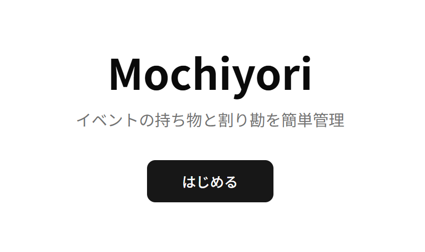
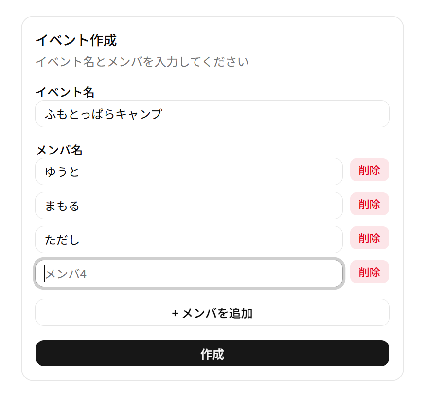
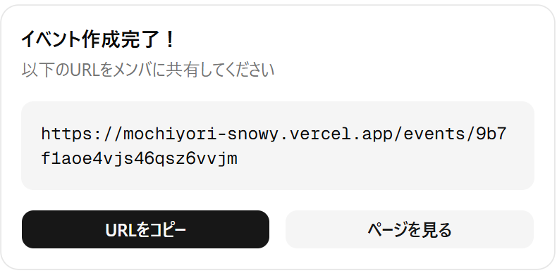
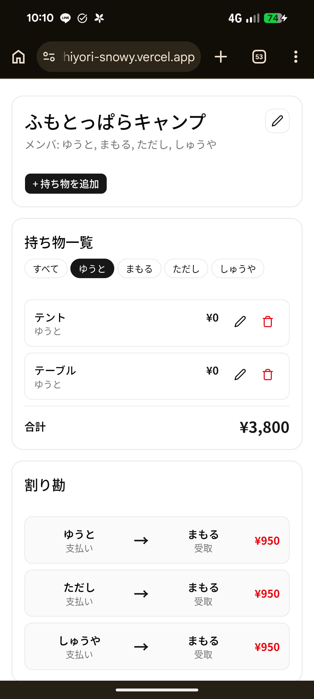
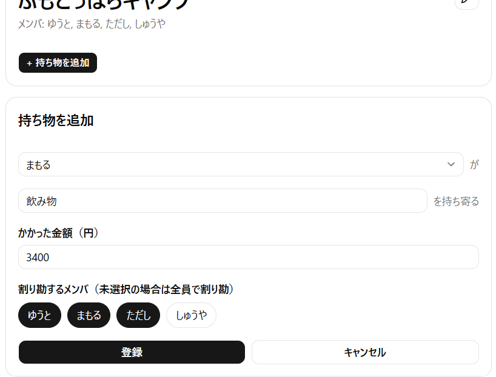
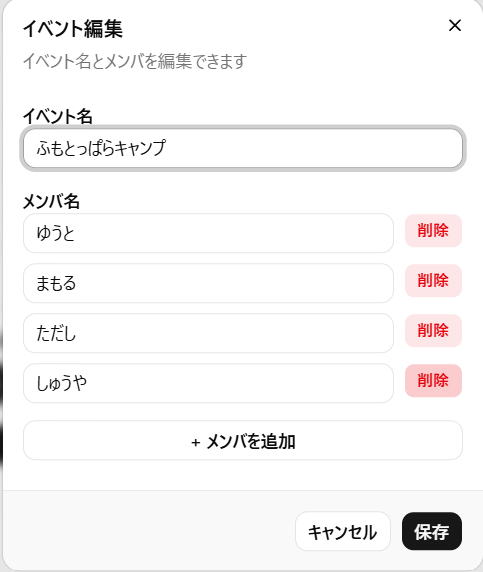
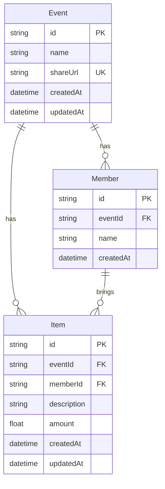

# Mochiyori（モチヨリ）

イベントの**持ち物管理**と**割り勘計算**を一元化する Web アプリケーション。

> 🏕️ 大人数でのキャンプや BBQ で、「誰が何を持ってくるか」「誰が誰にいくら払うか」の管理が煩雑という実体験が開発のきっかけ。

---


## 機能一覧

| 機能 | 説明 |
|---|---|
| **イベント作成** | イベント名とメンバーを入力し、共有用 URL を発行　|
| **持ち物追加** | メンバー・品名・金額を登録し、一覧に反映 |
| **持ち物編集・削除** | 登録済みの項目を後から変更・削除可能 |
| **割り勘計算** | 各自の支払い額を集計し、過不足を精算する「誰が誰にいくら払うか」を自動算出 |
| **URL シェア** | ログイン不要。URL を知っている人全員が閲覧・編集可能 |

---

## 画面一覧

| # | 画面 | URL | プレビュー | 説明 |
|---|------|-----|-----------|------|
| 1 | **トップページ** | `/` |  | 「はじめる」ボタンのみのシンプルなランディング |
| 2 | **イベント作成（入力）** | `/events/new` |  | イベント名とメンバー名を入力 |
| 3 | **イベント作成（完了）** | `/events/new` |  | 作成完了後、共有用URLが表示される |
| 4 | **イベント詳細** | `/events/[shareUrl]` |  | 持ち物一覧・割り勘結果を1画面で表示 |
| 5 | **持ち物追加フォーム** | `/events/[shareUrl]` |  | メンバー・品名・金額・割り勘対象を入力 |
| 6 | **編集ダイアログ** | `/events/[shareUrl]` |  | イベント名・メンバー編集ダイアログ |

### 各画面の詳細

**1. トップページ** (`/`)
- アプリ名「Mochiyori」とキャッチコピーを表示
- 「はじめる」ボタンでイベント作成へ遷移

**2. イベント作成（入力）** (`/events/new`)
- イベント名とメンバー名を自由に入力（メンバーは追加/削除可能）
- 「作成」ボタンでイベント生成

**3. イベント作成（完了）** (`/events/new`)
- 生成されたイベントの共有用URLが表示される
- 「URLをコピー」でクリップボードにコピー、「ページを見る」でイベント詳細へ遷移

**4. イベント詳細** (`/events/[shareUrl]`)
- **ヘッダー**: イベント名（編集ボタンあり）、メンバー一覧、持ち物追加ボタン
- **持ち物一覧**: 全メンバーの持ち物が時系列で表示。メンバー名のフィルターボタンで絞り込み可能。各項目は編集・削除可能
- **割り勘結果**: 「誰が誰にいくら払うか」が自動計算されて表示

**5. 持ち物追加フォーム**
- ドロップダウンでメンバー選択 → 品名 → 金額 → 割り勘対象メンバーをトグルで選択して登録
- 編集時も同様のフォームが開く

**6. 編集ダイアログ**
- イベント名の横の編集ボタンから開く
- イベント名の変更、メンバーの追加/削除が可能

---

## システム構成図


## 技術スタック

| 層 | 技術 |
|---|---|
| **フレームワーク** | Next.js 16 (App Router) |
| **言語** | TypeScript |
| **UI** | Tailwind CSS 4 |
| **ORM** | Prisma 7 |
| **データベース** | Supabase (PostgreSQL) |
| **インフラ** | Vercel |
| **CI/CD** | Github Actions |


### 技術選定理由

- **Next.js 16 + App Router**: サーバーコンポーネントと API Routes を同一プロジェクトで管理でき、小規模アプリに最適。
- **Supabase + Prisma**: マネージド Postgres で運用コストを抑えつつ、Prisma の型安全なクエリで開発速度を向上。
- **Tailwind CSS 4**: ユーティリティファーストでスタイルを完結させ、コンポーネント設計に集中。
- **Vercel**: Next.js との親和性が高く、CI/CD が最小構成で完了。
- **Github Actions**: 週次でSupabaseのAPIエンドポイントへリクエストを送信し、無料プラン環境におけるデータベースの自動停止を防止。
---

## データモデル



- `Event.shareUrl` を一意キーとし、URL ベースの共有を実現。
- `Member` には `(eventId, name)` の複合一意制約を設定し、同名メンバーの重複を防止。
- カスケード削除により、イベント削除で関連するメンバー・持ち物も自動削除。


---

## 開発のポイント

### 1. 割り勘アルゴリズム

`calculateSettlements()` は、各メンバーの支払い総額と平均額の差を収支として計算し、不足者（債務者）から過多者（債権者）へ最小回数のやり取りで精算するグリーディアルゴリズムを実装。

```
例: A: ¥3,000, B: ¥1,000, C: ¥500, D: ¥0（計 ¥4,500, 平均 ¥1,125）
  → C が A に ¥625, D が B に ¥125, D が A に ¥1,000 を支払う
```

### 2. ログインレス共有

認証機能を実装せず、一意な `shareUrl` のみでアクセスを制御。これにより、
- ユーザー登録の手間を排除
- イベント単位の URL をコピーするだけで招待完了
- モバイルフレンドリーな操作感を優先

### 3. Prisma のアダプタ切り替え

開発時は Better-SQLite3（ローカル）、本番は Supabase Postgres と、Prisma アダプタの差し替えだけで DB を切り替えられる設計。

---

## ローカル開発

```bash
# 依存関係インストール
npm install

# Prisma クライアント生成 & DB 作成
npx prisma generate
npx prisma db push

# 開発サーバー起動
npm run dev
```

`.env` に `DATABASE_URL` / `DIRECT_URL` を設定すれば Supabase 接続も可能。未設定の場合は SQLite (`dev.db`) が使われる。

---

## デプロイ

[Vercel](https://vercel.com) にリポジトリを連携するだけでデプロイ完了。環境変数 `DATABASE_URL` / `DIRECT_URL` に Supabase の接続文字列を設定する。
